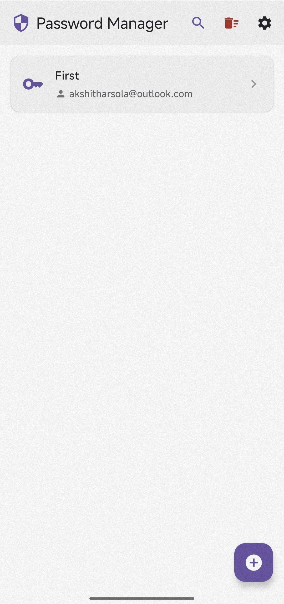
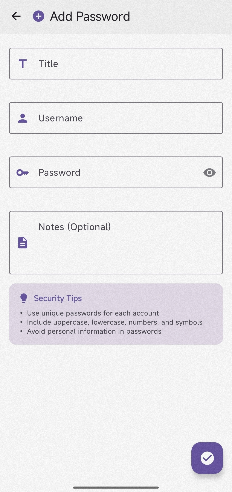
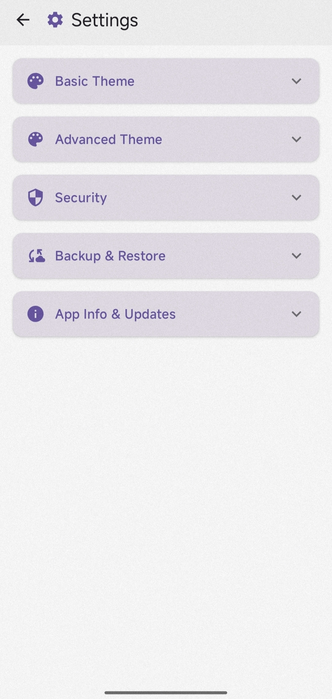
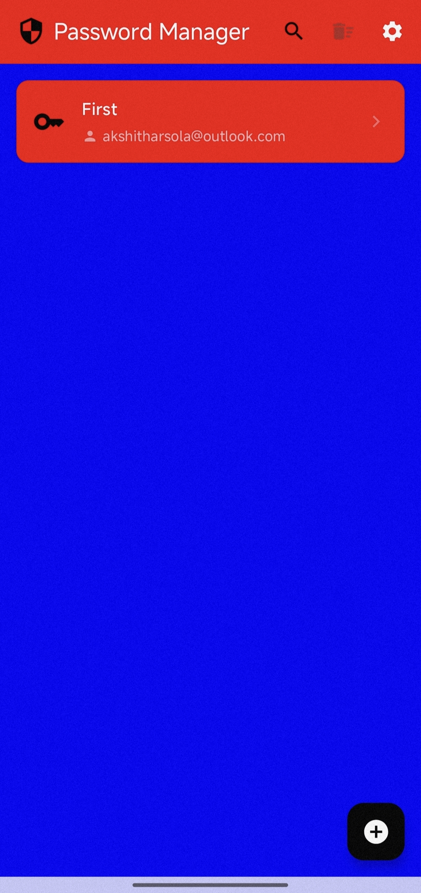

# 🔐 SecureVault Android

**A quantum-resistant, hardware-backed password manager for Android. Your passwords never leave your device.**

[](https://github.com/akshitharsola/Secure-Vault/releases/latest)
[](LICENSE)
[](https://developer.android.com)
[](https://kotlinlang.org)

SecureVault is a modern, security-focused password manager built with cutting-edge encryption technologies. Version 2.0 introduces **hardware-backed encryption** and **quantum-resistant backups**, making it one of the most secure password managers available for Android.

---

## ✨ Key Features

### 🔒 Security (v2.0+)
- **Hardware-Backed Encryption**: AES-256-GCM via Android Keystore (keys stored in TEE/Secure Element)
- **Quantum-Resistant Backups**: ML-KEM-768 + X25519 + AES-256-GCM hybrid encryption
- **Zero Knowledge**: All data encrypted locally - no server access, ever
- **Tamper Detection**: GCM authentication tags detect data corruption
- **Automatic Migration**: Seamless upgrade from plain text to encrypted storage
- **Biometric Auth**: Fingerprint/face unlock with secure PIN fallback
- **Offline-First**: Passwords are never transmitted — no cloud, no sync, no tracking. INTERNET permission used only for optional update checks

### 🎨 User Experience
- **Material 3 Design**: Modern, beautiful interface
- **Dark/Light Themes**: System-synchronized theming
- **Smart Search**: Instant password search with keyboard auto-focus
- **Smart Back Button**: Intuitive navigation (search → list → exit)
- **Auto-Clear Clipboard**: Security-first clipboard management
- **In-App Updates**: Automatic update notifications with browser fallback

### 🏗️ Technical Excellence
- **Clean Architecture**: SOLID principles with clear separation of concerns
- **Jetpack Compose**: Modern declarative UI
- **Room Database**: Encrypted local storage
- **100% Kotlin**: Type-safe, null-safe codebase
- **Transaction Safety**: Atomic backup restore with rollback
- **Comprehensive Logging**: Debug-friendly with detailed diagnostics

---

## 📥 Installation

### Option 1: Download Latest Release (Recommended)

1. Go to [Releases](https://github.com/akshitharsola/Secure-Vault/releases/latest)
2. Download **app-release.apk**
3. Enable "Install from Unknown Sources" in Settings
4. Install the APK
5. Grant biometric permissions when prompted

### Option 2: Build from Source

```bash
git clone https://github.com/akshitharsola/Secure-Vault.git
cd Secure-Vault
./gradlew assembleRelease
```

The APK will be in `app/build/outputs/apk/release/app-release.apk`

---

## 📋 Requirements

- **Minimum**: Android 7.0 (API 24)
- **Target**: Android 15 (API 35)
- **Storage**: ~20 MB
- **Recommended**: Device with biometric hardware
- **Current Version**: v2.0.4 (January 2026)

---

## 🚀 What's New in v2.0

### Major Security Overhaul

| Feature | Before (v1.x) | After (v2.0) |
|---------|---------------|--------------|
| **Database Storage** | ❌ Plain text | ✅ AES-256-GCM encrypted |
| **Encryption Keys** | ❌ SharedPreferences | ✅ Android Keystore (hardware) |
| **Backup Format** | ⚠️ Classical crypto | ✅ Quantum-resistant (ML-KEM-768) |
| **Tamper Detection** | ❌ None | ✅ GCM authentication tags |
| **Root Protection** | ❌ Keys extractable | ✅ Hardware-backed (safe) |
| **Migration** | ⚠️ Manual | ✅ Automatic |

### Vulnerability Fixes

**v1.0 - v1.5.1**: Passwords stored in **plain text** in database (CRITICAL)
**v2.0+**: All passwords encrypted before database storage ✅

---

## 🎯 Quick Start

### First Launch
1. **Biometric Setup**: Enable fingerprint/face unlock (optional but recommended)
2. **Set PIN Fallback**: Create a secure backup PIN
3. **Add Passwords**: Tap the + button to store your first password
4. **Create Backup**: Settings → Backup (recommended)

### Upgrading from v1.x

**Good News**: Automatic migration! 🎉

When you launch v2.0 for the first time:
1. App detects plain text passwords
2. Automatically re-encrypts with Android Keystore
3. Deletes old insecure keys
4. Migration completes in < 1 second
5. All done - no user action required!

**Tip**: Create a backup first for safety (Settings → Backup)

---

## 🏛️ Architecture

SecureVault follows Clean Architecture with clear separation of concerns:

<div align="center">
  
</div>

The architecture consists of four distinct layers:
- **UI Layer**: Jetpack Compose screens with ViewModels for state management
- **Domain Layer**: Business logic encapsulated in use cases
- **Data Layer**: Repository pattern with encrypted data access (Room + Keystore)
- **Security Layer**: Hardware-backed encryption via Android Keystore (AES-256-GCM)

### Key Components

| Component | Purpose | Technology |
|-----------|---------|------------|
| **UI** | User interface | Jetpack Compose |
| **ViewModels** | State management | Kotlin Coroutines + Flow |
| **Use Cases** | Business logic | Clean Architecture pattern |
| **Repository** | Data abstraction | Repository pattern |
| **DAO** | Database access | Room Database |
| **SecurityManager** | Encryption | Android Keystore + AES-256-GCM |
| **BackupManager** | Import/Export | Quantum encryption (v2.0) |
| **MigrationManager** | Version upgrades | Automatic migration |

---

## 🔐 Security Deep Dive

### Encryption Architecture

**Database Encryption** (v2.0+)
```
Plaintext Password
      ↓
[Android Keystore] ← Hardware-backed key (never leaves TEE)
      ↓
AES-256-GCM Encryption (random IV per entry)
      ↓
Base64(IV + Ciphertext + Auth Tag)
      ↓
Room Database Storage
```

**Backup Encryption** (v2.0+)
```
Password List (JSON)
      ↓
User Password → PBKDF2-HMAC-SHA512 (100k iterations)
      ↓
AES-256-GCM Encryption
      ↓
Quantum Metadata (ML-KEM-768 + X25519 for future)
      ↓
Encrypted Backup File (.backup)
```

### Security Features

| Feature | Implementation | Security Level |
|---------|----------------|----------------|
| **Key Storage** | Android Keystore TEE | ⭐⭐⭐⭐⭐ Hardware-backed |
| **Encryption** | AES-256-GCM | ⭐⭐⭐⭐⭐ Authenticated |
| **Quantum Resistance** | ML-KEM-768 (backups) | ⭐⭐⭐⭐⭐ Post-quantum |
| **Key Derivation** | PBKDF2-SHA512 (100k) | ⭐⭐⭐⭐ Industry standard |
| **Tamper Detection** | GCM auth tags | ⭐⭐⭐⭐⭐ Cryptographic |
| **Root Protection** | Hardware TEE | ⭐⭐⭐⭐⭐ Keys non-extractable |

### Threat Model

**Protected Against:**
- ✅ Physical device access (encrypted at rest)
- ✅ Root access (keys in hardware)
- ✅ ADB backup extraction (database encrypted)
- ✅ Memory dumps (keys never in app memory)
- ✅ Side-channel attacks (GCM authenticated)
- ✅ Quantum computers (backup encryption)
- ✅ Data tampering (authentication tags)

**Not Protected Against:**
- ❌ Device unlocked + malicious app with accessibility service
- ❌ Compromised Android Keystore implementation
- ❌ Physical device compromise while unlocked
- ❌ Weak user-chosen backup passwords

**Best Practices:**
- Use strong device lock screen
- Keep device updated with security patches
- Use strong backup passwords (16+ characters)
- Review installed apps regularly
- Create regular backups
- Store backups securely offline

---

## 📸 Screenshots

| Main Screen | Add Password | Settings | Search |
|-------------|--------------|----------|--------|
|  |  |  |  |


---

## 🛠️ Development

### Prerequisites
- Android Studio Hedgehog or newer
- JDK 11 or newer
- Android SDK API 35
- Git

### Setup
```bash
# Clone repository
git clone https://github.com/akshitharsola/Secure-Vault.git
cd Secure-Vault

# Build project
./gradlew build

# Run tests
./gradlew test

# Install on device
./gradlew installDebug
```

### Build Variants
```bash
# Debug APK (unsigned)
./gradlew assembleDebug

# Release APK (requires signing)
./gradlew assembleRelease

# Run lint checks
./gradlew lint

# Generate test coverage
./gradlew jacocoTestReport
```

### Code Style
- **Language**: Kotlin 100%
- **Style Guide**: Official Kotlin conventions
- **Architecture**: Clean Architecture + MVVM
- **Naming**: Descriptive, self-documenting code
- **Comments**: Only for complex logic
- **Testing**: Unit tests for business logic

---

## 🤝 Contributing

We welcome contributions! Here's how:

### Reporting Issues
1. Check [existing issues](https://github.com/akshitharsola/Secure-Vault/issues)
2. Create detailed bug report with:
   - Device model & Android version
   - App version
   - Steps to reproduce
   - Expected vs actual behavior
   - Logcat output (if applicable)

### Pull Requests
1. Fork the repository
2. Create feature branch: `git checkout -b feature/amazing-feature`
3. Follow code style guidelines
4. Add tests for new features
5. Update documentation
6. Commit: `git commit -m 'feat: Add amazing feature'`
7. Push: `git push origin feature/amazing-feature`
8. Open Pull Request with description

### Security Vulnerabilities
**DO NOT** open public issues for security vulnerabilities.

**Instead:**
- Report privately via [GitHub Security Advisories](https://github.com/akshitharsola/Secure-Vault/security)
- Email: *Check LICENSE for contact*
- Allow reasonable time for patches
- Responsible disclosure appreciated

---

## 👥 Contributors

### Core Team

<table>
  <tr>
    <td align="center">
      <a href="https://github.com/akshitharsola">
        
        <br />
        <sub><b>Akshit Harsola</b></sub>
      </a>
      <br />
      <sub>Original Author & Maintainer</sub>
    </td>
  </tr>
</table>

### How to Become a Contributor

Contribute code, documentation, or bug reports to appear here!

**Contributors are automatically recognized via GitHub's contributor system.**

---

## 📚 Documentation

| Document | Description |
|----------|-------------|
| [DEV_GUIDE.md](.github/DEV_GUIDE.md) | Developer guide for contributors |
| [LICENSE](LICENSE) | MIT License with security disclaimers |
| [MIGRATION_GUIDE.md](docs/MIGRATION_GUIDE.md) | Upgrade instructions |
| [DATABASE_ENCRYPTION_IMPLEMENTATION.md](docs/DATABASE_ENCRYPTION_IMPLEMENTATION.md) | v2.0 security architecture |

---

## 🗺️ Roadmap

### Upcoming Features
- [ ] Password strength analyzer
- [ ] Breach detection (offline)
- [ ] Password generator with custom rules
- [ ] Secure notes storage
- [ ] Categories/folders
- [ ] Password history

### Future
- [ ] Full quantum-resistant database encryption
- [ ] Auto-fill service integration
- [ ] Wear OS companion app
- [ ] Import from other managers
- [ ] Browser extension integration

### Long-Term Vision
- [ ] Desktop applications (Windows/Mac/Linux)
- [ ] Hardware security key support (YubiKey)
- [ ] Multi-vault support
- [ ] Shared vaults (family/team)
- [ ] Password audit & compliance

**Vote on features**: [GitHub Discussions](https://github.com/akshitharsola/Secure-Vault/discussions)

---

## 📊 Technology Stack

| Category | Technology | Purpose |
|----------|------------|---------|
| **Language** | Kotlin 100% | Type-safe, modern |
| **UI** | Jetpack Compose | Declarative UI |
| **Architecture** | Clean Architecture | Separation of concerns |
| **Database** | Room | Local storage |
| **Encryption** | Android Keystore | Hardware-backed keys |
| **PQC** | Bouncy Castle (ML-KEM-768) | Quantum resistance |
| **Auth** | Biometric API | Fingerprint/face |
| **DI** | Manual DI (AppModule) | Lightweight |
| **Async** | Kotlin Coroutines | Concurrency |
| **Build** | Gradle (Kotlin DSL) | Build system |
| **Testing** | JUnit 4 + Espresso | Quality assurance |
| **CI/CD** | GitHub Actions | Automated releases |

---

## 📄 License

This project is licensed under the **MIT License** with additional security disclaimers.

See [LICENSE](LICENSE) file for full details.

**TL;DR**:
- ✅ Free to use, modify, distribute
- ✅ Open source
- ✅ Commercial use allowed
- ⚠️ Provided as-is
- ⚠️ Use at your own risk
- 📧 Responsible disclosure for vulnerabilities

---

## 🙏 Acknowledgments

- **Android Jetpack Team**: Excellent libraries and architecture guidance
- **Material Design Team**: Beautiful, accessible design system
- **NIST**: Post-quantum cryptography standardization
- **Bouncy Castle**: Comprehensive cryptography library
- **Kotlin Team**: Modern, expressive language
- **Open Source Community**: Continuous inspiration and support

---

## 💝 Support Development

SecureVault is **free and open source**, built with passion to provide a truly secure password manager.

If you find it useful, consider supporting continued development:

- ⭐ **Star the repository** on GitHub
- 🐛 **Report bugs** and suggest features
- 💰 **GitHub Sponsors**: [Sponsor @akshitharsola](https://github.com/sponsors/akshitharsola) *(Coming soon)*
- ☕ **Ko-fi**: [Buy me a coffee](https://ko-fi.com/securevault) *(Coming soon)*
- 📢 **Share** with privacy-conscious friends

**Why donate?**
- Helps cover development time
- Supports ongoing security updates
- Funds future features (autofill, browser extension, etc.)
- Keeps the app 100% free with **zero ads, zero tracking**

Every contribution, no matter how small, makes a difference! 🙏

---

## 📞 Support & Community

- **🐛 Bug Reports**: [GitHub Issues](https://github.com/akshitharsola/Secure-Vault/issues)
- **💡 Feature Requests**: [GitHub Discussions](https://github.com/akshitharsola/Secure-Vault/discussions)
- **🔒 Security**: [Security Advisories](https://github.com/akshitharsola/Secure-Vault/security)
- **📖 Documentation**: [Wiki](https://github.com/akshitharsola/Secure-Vault/wiki) (coming soon)
- **⭐ Star**: Show support by starring the repository!

---

## ⚠️ Disclaimer

**This is security-critical software. Use at your own risk.**

While SecureVault implements state-of-the-art security practices including hardware-backed encryption, quantum-resistant backups, and comprehensive tamper detection, **no software is 100% secure**.

**Recommendations:**
- ✅ Review source code before use
- ✅ Create regular encrypted backups
- ✅ Use strong backup passwords
- ✅ Keep device updated
- ✅ Test restore process periodically
- ⚠️ Don't rely on this as sole password storage
- ⚠️ Use reputable offline backup storage

**The developers are not liable for data loss, unauthorized access, or security breaches.**

For complete legal terms, see [LICENSE](LICENSE).

---

<div align="center">

**Made with ❤️ and 🔒 by Akshit Harsola and Contributors**

**Powered by quantum-resistant encryption and Android Keystore**

[⬆ Back to Top](#-securevault-android)

</div>
